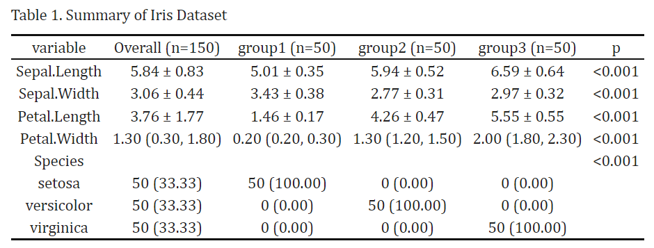

# tidysummary

<!-- badges: start -->

<!-- badges: end -->

The goal of tidysummary is to streamlines the analysis of clinical data by automatically selecting appropriate statistical descriptions and inference methods based on variable types. See [the vignette](https://htqqdd.github.io/tidysummary/articles/tidysummary.html) for more details.

## Installation

You can install the released version of tidysummary from CRAN with:

``` r
install.packages("tidysummary")
```

And the development version from GitHub with:

``` r
# install.packages("pak")
pak::pak("htqqdd/tidysummary")
```

## Usage

### A quick example

``` r
library(tidysummary)
result <- iris %>%
  add_var() %>%
  add_summary() %>%
  add_p()
```

### Another example

``` r
#Here is an prepared dataset
iris <- iris %>%
  mutate(group = factor(rep(1:3, each = 50),
                        labels = c("group1", "group2", "group3")))

#Now use tidysummary
library(tidysummary)
result <- iris %>%
  add_var() %>%
  add_summary(binary_show = "all") %>%
  add_p()
```

#### Following options

-   Use as DataFrame

``` r
View(result)
```

-   Display as HTML (use `kableExtra` or others your prefer)

``` r
library(kableExtra)
result[is.na(result)] <- ""
result %>%
  kbl(caption = "Table 1. Summary of Iris Dataset",
      row.names = F,
      align = "c") %>%
  kable_classic(full_width = FALSE, html_font = "Cambria")
```



-   Save as Excel (.xlsx)

``` r
result %>%
  writexl::write_xlsx("./test.xlsx")
```
